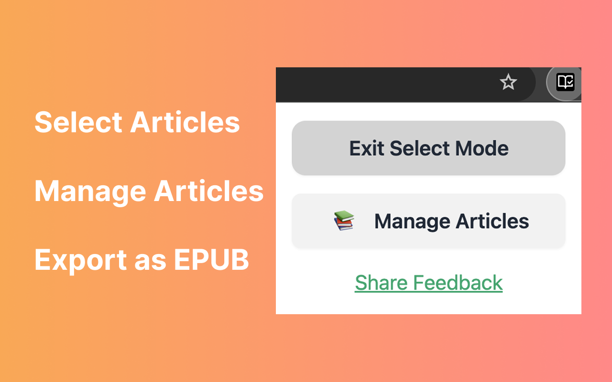

# Blog to EPUB

A Chrome extension that converts blog articles and web content into EPUB files for offline reading.

## 🌟 Features

- **🎯 Smart Article Selection**: Interactive selection mode with visual feedback - click links to select articles
- **📚 Article Management**: Organize articles with drag-and-drop reordering
- **🔄 Batch Export**: Export multiple articles at once with real-time progress tracking
- **🖼️ Image Processing**: Options to download and embed images for offline reading
- **🔗 Hyperlink Control**: Choose to preserve or remove hyperlinks in exported content
- **🛡️ Privacy First**: All processing happens locally in your browser - no data sent to servers
- **⚡ Modern UI**: Clean, responsive interface built with React, Tailwind CSS, DaisyUI

## 📸 Screenshots

### Extension Popup

<div align="center">
  
  
</div>

### Article Selection

<div align="center">
  
  <br />
  <em>Interactive article selection with visual feedback</em>
</div>

### Selected Articles

<div align="center">
  
  <br />
  <em>Selected articles highlighted in yellow</em>
</div>

### Export Progress

<div align="center">
  
  <br />
  <em>Real-time export progress with detailed status updates</em>
</div>

### Article Management

<div align="center">
  
  <br />
  <em>Organize and manage your saved articles</em>
</div>

### EPUB Output

<div align="center">
  
  <br />
  <em>Clean, readable EPUB files ready for your e-reader</em>
</div>

## 🚀 Quick Start

### Installation

#### Option 1: Chrome Web Store (Recommended)

Install directly from the [Chrome Web Store](https://chromewebstore.google.com/detail/ffolllebnagcedlagopfobpaohndjbmb)

#### Option 2: Manual Installation (Development)

```bash
# Clone the repository
git clone https://github.com/mia-zhao/blog-to-epub.git
cd blog-to-epub

# Install dependencies
pnpm install

# Build the extension
pnpm run build

# Load the extension in Chrome
# 1. Open Chrome and go to chrome://extensions/
# 2. Enable "Developer mode"
# 3. Click "Load unpacked" and select the `build` folder
```

### How to Use

#### 1. Select Articles

1. **Navigate** to any blog or article website
2. **Click** the extension icon in your browser toolbar
3. **Choose** "Select Articles" to enter selection mode
4. **Click** on article links to select them (they'll highlight in yellow)
5. **Double-click** links to quickly select multiple articles
6. **Click again** on selected links to deselect them

> **💡 Pro Tip**: Use double-click for rapid multi-selection, single-click to toggle individual articles

#### 2. Save or Export

- **Save for later**: Click "Save for later" to store articles in "Saved Articles" collection (accessible from "Manage Articles")
- **Generate EPUB**: Click "Generate EPUB" to review selected articles and export them to an EPUB file

#### 3. Manage Articles

1. **Click** the extension icon
2. **Select** "Manage Articles"
3. **Drag and drop** to reorder articles
4. **Select** articles and click "Delete" to remove them
5. **Click** "Export EPUB" to download selected articles

#### 4. Configure Settings

- **Click** the settings icon (⚙️) to access export options
- **Toggle** image processing (include/exclude offline images)
- **Toggle** hyperlink preservation (keep/remove links in content)

## 🏗️ Architecture

The extension follows a modular architecture with clear separation of concerns:

### Core Processing Engine

```
lib/core/
├── builders/
│   └── epub.ts              # EPUB file generation with proper metadata
├── utils/
│   ├── errors.ts            # Custom error classes and user-friendly messages
│   └── semaphore.ts         # Concurrency control for batch processing
├── content-extractor.ts     # DOM content extraction with tab management
├── export-controller.ts     # Export orchestration with progress tracking
├── preprocessor.ts          # Content cleaning and image processing
└── types.ts                 # TypeScript type definitions
```

### Extension Infrastructure

```
popup/                      # Extension popup interface
└── index.tsx               # Main popup with select mode toggle

options/                    # Article management interface
├── index.tsx               # Options page with article management
├── collection-actions.tsx  # Export buttons and progress indicators
├── collection-table.tsx    # Article list with drag-and-drop support
├── error-state.tsx         # Error display components
└── loading-state.tsx       # Loading state indicators

contents/                   # Content scripts (injected into web pages)
├── select-mode-panel.tsx   # Article selection overlay UI
└── handle-selection.ts     # Selection event handling logic

components/                 # Reusable UI components
├── draggable-overlay.tsx  # Draggable panel for select mode visual feedback
├── settings-modal.tsx      # Export settings configuration
└── toast.tsx               # Toast notification

background.ts               # Background service worker
```

## ⚙️ Configuration & Settings

### Export Options

- **📷 Image Processing**:
  - ✅ **Enabled**: Downloads and embeds images as base64 for offline viewing
  - ❌ **Disabled**: Preserves original image URLs (requires internet connection)
- **🔗 Hyperlink Handling**:
  - ✅ **Preserve**: Keeps clickable links in the EPUB
  - ❌ **Remove**: Converts links to plain text (preserves images in links)

### Content Processing Pipeline

The extension uses a sophisticated multi-stage processing system:

1. **🎯 Selection Phase**: Interactive link selection with visual feedback
2. **📄 DOM Extraction**: Lightweight content script extracts raw HTML from each page
3. **🧹 Content Cleaning**: Mozilla Readability removes ads, navigation, and clutter
4. **🖼️ Image Processing**: Downloads and embeds images for offline access (optional)
5. **🔗 Link Processing**: Intelligently handles hyperlinks based on user preferences
6. **📚 EPUB Generation**: Creates standards-compliant EPUB files with proper metadata
7. **⬇️ Download**: Automatically downloads the generated EPUB file

## 🛠️ Development

### Prerequisites

- **Node.js** 18+ and **pnpm** package manager
- **Chrome/Chromium** browser for testing
- Basic knowledge of **React** and **TypeScript**

### Development Setup

```bash
# Clone the repository
git clone https://github.com/mia-zhao/blog-to-epub.git
cd blog-to-epub

# Install dependencies
pnpm install

# Start development server with hot reload
pnpm run dev

# Build for production
pnpm run build

# Package for distribution
pnpm run package
```

### Development Workflow

1. **Start Development**: Run `pnpm run dev` for hot reload during development
2. **Load Extension**: Load the `build/chrome-mv3-dev` folder in Chrome's developer mode
3. **Test Changes**: Extension automatically reloads when you make changes
4. **Build Production**: Run `pnpm run build` to create optimized build
5. **Package**: Run `pnpm run package` to create distributable ZIP file

### Technology Stack

| Component              | Technology                   | Purpose                                 |
| ---------------------- | ---------------------------- | --------------------------------------- |
| **Framework**          | React + TypeScript           | UI components and type safety           |
| **Build System**       | Plasmo                       | Chrome extension development framework  |
| **Content Processing** | Mozilla Readability          | Article content extraction and cleaning |
| **File Generation**    | JSZip                        | EPUB file creation and compression      |
| **Styling**            | Tailwind CSS + DaisyUI       | Responsive UI design system             |
| **State Management**   | React Hooks + Plasmo Storage | Local state and persistent storage      |
| **Concurrency**        | Custom Semaphore             | Controlled batch processing             |

### Key Features Implementation

- **🎯 Smart Selection**: Uses content scripts with DOM event handling
- **📊 Progress Tracking**: Real-time progress callbacks with detailed status
- **🔄 Concurrency Control**: Semaphore-based limiting to prevent browser overload
- **💾 Persistent Storage**: Plasmo Storage API for article management
